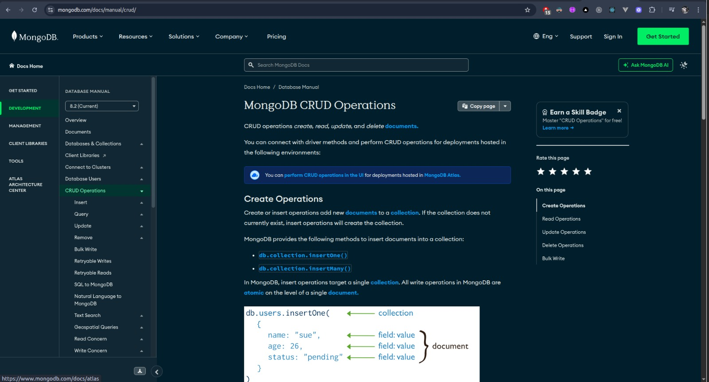

# MongoDB CRUD Operations

CRUD operations *create*, *read*, *update*, and *delete*
[documents](https://mongodb.com/docs/manual/core/document/#std-label-bson-document-format).

You can connect with driver methods and perform CRUD operations for deployments hosted in the following environments:

[perform CRUD operations in the UI](https://www.mongodb.com/docs/atlas/atlas-ui/documents/)You can [perform CRUD operations in the UI](https://www.mongodb.com/docs/atlas/atlas-ui/documents/) for deployments hosted in [MongoDB Atlas](https://www.mongodb.com/docs/atlas).

## Create Operations

Create or insert operations add new [documents](https://mongodb.com/docs/manual/core/document/#std-label-bson-document-format) to a [collection](https://mongodb.com/docs/manual/core/databases-and-collections/#std-label-collections). If the collection does not currently exist, insert operations will create the collection.

MongoDB provides the following methods to insert documents into a collection:

- [`db.collection.insertOne()`](https://mongodb.com/docs/manual/reference/method/db.collection.insertOne/#mongodb-method-db.collection.insertOne)

- [`db.collection.insertMany()`](https://mongodb.com/docs/manual/reference/method/db.collection.insertMany/#mongodb-method-db.collection.insertMany)

In MongoDB, insert operations target a single [collection](https://mongodb.com/docs/manual/reference/glossary/#std-term-collection). All write operations in MongoDB are [atomic](https://mongodb.com/docs/manual/core/write-operations-atomicity/) on the level of a single [document](https://mongodb.com/docs/manual/core/document/#std-label-bson-document-format).

For examples, see [Insert Documents](https://mongodb.com/docs/manual/tutorial/insert-documents/).

## Read Operations

Read operations retrieve [documents](https://mongodb.com/docs/manual/core/document/#std-label-bson-document-format) from a [collection](https://mongodb.com/docs/manual/core/databases-and-collections/#std-label-collections); i.e. query a collection for documents. MongoDB provides the following methods to read documents from a collection:

- [`db.collection.find()`](https://mongodb.com/docs/manual/reference/method/db.collection.find/#mongodb-method-db.collection.find)

You can specify [query filters or criteria](https://mongodb.com/docs/manual/tutorial/query-documents/#std-label-read-operations-query-argument) that identify the documents to return.

For examples, see:

- [Query Documents](https://mongodb.com/docs/manual/tutorial/query-documents/)

- [Query on Embedded/Nested Documents](https://mongodb.com/docs/manual/tutorial/query-embedded-documents/)

- [Query an Array](https://mongodb.com/docs/manual/tutorial/query-arrays/)

- [Query an Array of Embedded Documents](https://mongodb.com/docs/manual/tutorial/query-array-of-documents/)

## Update Operations

Update operations modify existing [documents](https://mongodb.com/docs/manual/core/document/#std-label-bson-document-format) in a [collection](https://mongodb.com/docs/manual/core/databases-and-collections/#std-label-collections). MongoDB provides the following methods to update documents of a collection:

- [`db.collection.updateOne()`](https://mongodb.com/docs/manual/reference/method/db.collection.updateOne/#mongodb-method-db.collection.updateOne)

- [`db.collection.updateMany()`](https://mongodb.com/docs/manual/reference/method/db.collection.updateMany/#mongodb-method-db.collection.updateMany)

- [`db.collection.replaceOne()`](https://mongodb.com/docs/manual/reference/method/db.collection.replaceOne/#mongodb-method-db.collection.replaceOne)

In MongoDB, update operations target a single collection. All write operations in MongoDB are [atomic](https://mongodb.com/docs/manual/core/write-operations-atomicity/) on the level of a single document.

You can specify criteria, or filters, that identify the documents to update. These [filters](https://mongodb.com/docs/manual/core/document/#std-label-document-query-filter) use the same syntax as read operations.

For examples, see [Update Documents](https://mongodb.com/docs/manual/tutorial/update-documents/).

## Delete Operations

Delete operations remove documents from a collection. MongoDB provides the following methods to delete documents of a collection:

- [`db.collection.deleteOne()`](https://mongodb.com/docs/manual/reference/method/db.collection.deleteOne/#mongodb-method-db.collection.deleteOne)

- [`db.collection.deleteMany()`](https://mongodb.com/docs/manual/reference/method/db.collection.deleteMany/#mongodb-method-db.collection.deleteMany)

In MongoDB, delete operations target a single [collection](https://mongodb.com/docs/manual/reference/glossary/#std-term-collection). All write operations in MongoDB are [atomic](https://mongodb.com/docs/manual/core/write-operations-atomicity/) on the level of a single document.

You can specify criteria, or filters, that identify the documents to remove. These [filters](https://mongodb.com/docs/manual/core/document/#std-label-document-query-filter) use the same syntax as read operations.

For examples, see [Delete Documents](https://mongodb.com/docs/manual/tutorial/remove-documents/).

## Bulk Write

MongoDB provides the ability to perform write operations in bulk. For details, see [Bulk Write Operations](https://mongodb.com/docs/manual/core/bulk-write-operations/).