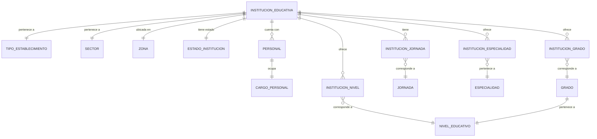

# Listado Colegios Oficiales 20251016

- Project: **Listado_colegios_oficiales_20251016**
- 📚 [Documentación](https://docs.google.com/document/d/1nwijOu7kT1J5EZ9AG5ys61OBG4a-kbuw/edit?usp=sharing&ouid=114885156140019858076&rtpof=true&sd=true)

Desarrollado por ALexi Durán Gómez C.c: 1.067.031.983